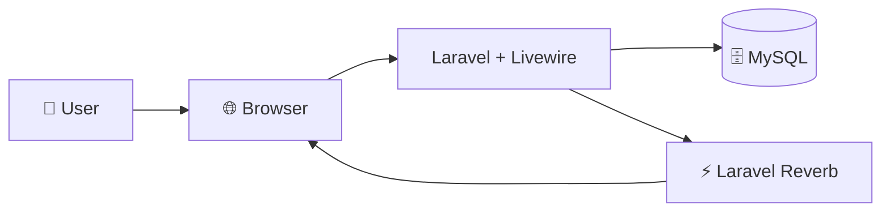
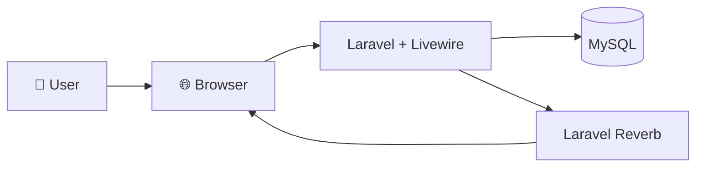

# 🍱 SMARTCANTEEN: Sistem Pemesanan Kantin Online Mahasiswa 🥤

<p align="center">
  <a href="http://kelas-c-4.informatika-unjedir.web.id/">
    
  </a>
</p>

<p align="center">
  
  
  
  
  
  
  
</p>

---

## 📌 Daftar Isi
*   [ 1. Deskripsi & Masalah Projek](#1-deskripsi-masalah-projek)
*   [ 2. Fitur Unggulan (Why SMARTCANTEEN?)](#2-fitur-unggulan-why-smartcanteen)
*   [ 3. Peran Pengguna & Fitur Sistem](#3-peran-pengguna-fitur-sistem)
*   [ 4. Matriks Implementasi Fitur (Checklist)](#4-matriks-implementasi-fitur-checklist)
*   [ 5. Arsitektur Sistem](#5-arsitektur-sistem)
*   [ 6. Struktur Direktori Utama](#6-struktur-direktori-utama)
*   [ 7. Skema & Entitas Database](#7-skema-entitas-database)
*   [ 8. Panduan Instalasi Lokal](#8-panduan-instalasi-lokal)
*   [ 9. Panduan Menjalankan Sistem](#9-panduan-menjalankan-sistem)
*   [ 10. Agile Development & Trello Workflow](#10-agile-development-trello-workflow)
*   [ 11. Dokumen Rekayasa Perangkat Lunak](#11-dokumen-rekayasa-perangkat-lunak)
*   [ 12. Informasi Proyek (Metadata)](#12-informasi-proyek-metadata)
*   [ 13. Tim Pengembang & Kontribusi](#13-tim-pengembang-kontribusi)
*   [ 14. Workflow Kolaborasi Git](#14-workflow-kolaborasi-git)
*   [ 15. Lisensi & Apresiasi](#15-lisensi)

---

##  1. Deskripsi & Masalah Projek

###  Permasalahan Nyata (Problem-First)
Berdasarkan hasil observasi lapangan di Kantin Utama Kampus Universitas Jenderal Soedirman dan wawancara mendalam yang dilakukan bersama narasumber (**Mas Eddy** selaku penjual kantin dan **Astria** selaku mahasiswa aktif), ditemukan sejumlah inefisiensi krusial pada alur pemesanan makanan tradisional:
1.  **Antrean Jam Istirahat:** Waktu tunggu pemesanan mencapai **15-25 menit** pada jam-jam puncak (11.30 - 13.00 WIB).
2.  **Keterlambatan Kuliah:** Mahasiswa sering kali terlambat masuk kelas berikutnya karena tertahan lama di area antrean kasir kantin.
3.  **Ketidakpastian Stok Menu:** Mahasiswa tidak mengetahui ketersediaan stok makanan sebelum datang ke stand, menyebabkan antrean sia-sia untuk menu yang ternyata sudah habis terjual.
4.  **Pencatatan Manual:** Penjual masih mencatat pesanan di lembaran kertas, memicu kesalahan membaca pesanan, tertukarnya antrean, serta hilangnya catatan transaksi.
5.  **Tanpa Estimasi Waktu (ETA):** Pembeli tidak mendapat perkiraan penyelesaian makanan, sehingga mereka harus berdiri menunggu secara tidak produktif di area dapur kantin.

###  Solusi: SMARTCANTEEN
**SMARTCANTEEN** adalah platform pemesanan makanan berbasis website responsif (*Responsive Web Application*) yang dirancang khusus untuk mengeliminasi antrean fisik di kantin kampus. Sistem ini dibangun menggunakan arsitektur monolitik reaktif **TALL Stack (Tailwind CSS, Alpine.js, Laravel, Livewire)** dikombinasikan dengan **Laravel Reverb (WebSocket Server)** untuk memfasilitasi interaksi dua arah secara instan bebas dari pemuatan ulang halaman (*reload*).

Dengan SMARTCANTEEN, mahasiswa dapat meninjau menu yang aktif, melakukan pemesanan daring dari dalam ruang kuliah, melakukan pembayaran digital simulatif, memantau proses penyiapan secara real-time, dan baru mendatangi stand kantin ketika notifikasi instan "Pesanan Siap Diambil" muncul di layar gawai mereka.

---

##  2. Fitur Unggulan (Why SMARTCANTEEN?)

Dibandingkan dengan proses pemesanan makanan kantin konvensional, SMARTCANTEEN menawarkan keunggulan struktural sebagai berikut:

> [!NOTE]
> ###  Reaktivitas Berkinerja Tinggi (SPA-Like Behavior)
> Pemanfaatan `wire:navigate` meminimalisasi overhead browser dengan hanya memuat data dinamis yang dibutuhkan, menghadirkan transisi halaman semulus *Single-Page Application* tanpa kehilangan fungsionalitas backend Laravel.

> [!TIP]
> ###  Estimasi Waktu Penyelesaian Dinamis (ETA)
> Sistem menghitung perkiraan durasi masak secara kumulatif berdasarkan antrean aktif di stand penjual dan durasi masak per item menu. Ini menjamin mahasiswa dapat mengatur waktu keberangkatan dari ruang kelas secara presisi.

> [!IMPORTANT]
> ###  WebSocket Sinkronisasi Real-Time Dua Arah
> Menggunakan Laravel Reverb native untuk menyebarkan perubahan status pesanan secara instan dalam waktu **< 2 detik** dari dashboard merchant langsung ke layar pelacak pembeli.

---

##  3. Peran Pengguna & Fitur Sistem

Sistem ini membatasi hak akses secara ketat melalui middleware **Role-Based Access Control (RBAC)** yang membagi sistem menjadi tiga peran utama:

###   A. Mahasiswa (Pembeli)
*   **Autentikasi Reaktif:** Formulir login dan registrasi (validasi NIM/Student ID dan Fakultas) dengan validasi instan (`wire:model.live`).
*   **Pencarian & Filter Pintar:** Menemukan menu favorit berdasarkan nama, kategori (makanan berat, makanan ringan, minuman), atau stand toko tertentu.
*   **Validasi Stok Real-Time:** Kuantitas menu divalidasi langsung ke database MySQL saat dimasukkan keranjang belanja; menu habis akan menonaktifkan tombol pemesanan.
*   **Simulasi Pembayaran Digital:** Mekanisme pembayaran digital simulasi (Dummy Payment) tertanam di modal Alpine.js tanpa gateway eksternal.
*   **OrderStatusTracker:** Halaman pelacak khusus yang menangkap broadcast status pesanan aktif secara live.
*   **Riwayat Pesanan:** Menyimpan log pemesanan masa lalu beserta total harga dan catatan khusus (misal: "tidak pedas").

###  B. Penjual Kantin (Merchant)
*   **Pendaftaran Profil Toko:** Registrasi khusus mencakup nama pemilik, nomor telepon, dan nama stand kantin yang memerlukan validasi admin sebelum aktif.
*   **Dashboard Antrean Pesanan:** Halaman live pemrosesan antrean pesanan masuk, diproses, siap diambil, hingga selesai/dibatalkan.
*   **Manajemen Inventaris:** Fitur menambah menu baru, memperbarui deskripsi, menyesuaikan harga, mengganti gambar menu, dan mengisi ulang/mengurangi stok.
*   **Notifikasi Suara:** Efek audio otomatis saat ada pesanan masuk yang sudah disimulasikan pembayarannya.
*   **Laporan Keuangan & Ekspor PDF:** Grafik statistik pendapatan harian/mingguan dan ekspor rekap penjualan berformat PDF formal via DOMPDF.

###  C. Admin Sistem
*   **Verifikasi Merchant Baru:** Panel persetujuan atau penolakan pendaftaran toko baru lengkap dengan input *Rejection Reason* jika ditolak.
*   **Manajemen Pengguna Global:** Kemampuan menonaktifkan/mengaktifkan kembali akun mahasiswa maupun penjual yang melanggar aturan.
*   **Audit Logger Service:** Halaman pemantauan log keamanan yang mencatat seluruh aktivitas kritis di platform dengan masa retensi minimal 90 hari.

---

##  4. Matriks Implementasi Fitur (Checklist)

Tabel berikut menunjukkan status implementasi sesungguhnya dari fitur-fitur aplikasi berdasarkan keselarasan kode sumber (*source code*):

| Kategori | Fitur / Komponen | Status Implementasi | Deskripsi Kode |
| :--- | :--- | :---: | :--- |
| **Autentikasi** | Registrasi Akun Mahasiswa & Penjual | ✅ | Komponen `RegisterForm` live validation |
| **Autentikasi** | Login dengan Lockout Keamanan | ✅ | Terkunci 15 menit setelah 5x salah password (`LoginForm`) |
| **Mahasiswa** | Katalog Menu & Info Stok Live | ✅ | Reactive update di `StudentHome` & `CanteenOrder` |
| **Mahasiswa** | Checkout & Pencatatan Nota | ✅ | Tersimpan dalam tabel `orders` dan `order_items` |
| **Mahasiswa** | Simulasi Pembayaran (Dummy) | ✅ | Modal pembayaran instan state-based di database |
| **Mahasiswa** | Estimasi Waktu (ETA) Pesanan | ✅ | Dihitung dari `cooking_time_minutes` antrean aktif |
| **Mahasiswa** | Pelacakan Status Real-Time | ✅ | `OrderStatusTracker` mendengarkan channel Reverb |
| **Mahasiswa** | Riwayat Transaksi Belanja | ✅ | Komponen `OrderHistory` memuat detail nota |
| **Penjual** | Live Order Queue Dashboard | ✅ | `SellerDashboard` auto-update via event listener |
| **Penjual** | Manajemen Menu & Stok Toko | ✅ | Insert, Update, Delete menu, Upload gambar menu |
| **Penjual** | Laporan Keuangan Harian/Mingguan | ✅ | `SalesReport` render data statistik |
| **Penjual** | Ekspor PDF Laporan Transaksi | ✅ | `SellerReportController` integrasi DOMPDF |
| **Admin** | Dashboard Statistik Ringkasan | ✅ | Visualisasi total user, merchant, audit logs |
| **Admin** | Verifikasi Toko Baru | ✅ | `SellerVerification` approve/reject merchant |
| **Admin** | Aktivasi/Deaktivasi Pengguna | ✅ | `UserManagement` toggle status `is_active` |
| **Admin** | Monitoring Audit Log Terpusat | ✅ | `AdminAuditLog` memuat record tabel `audit_logs` |
| **Keamanan** | Trait RBAC Terproteksi | ✅ | Trait `AuthorizesRole` di `mount()` Livewire |

---

##  5. Arsitektur Sistem

SMARTCANTEEN mengadopsi arsitektur reaktif monolitik di mana backend PHP dan state frontend disinkronkan melalui koneksi WebSocket persisten:



---

##  6. Struktur Direktori Utama

Berikut adalah bagian-bagian penting dari kode sumber aplikasi SMARTCANTEEN:

```text
CANDIRPLPEMWEBDALAMSATUMALAM/
├── app/
│   ├── Events/                     # Event broadcast WebSocket (Laravel Reverb)
│   │   └── OrderStatusUpdated.php  # Event perubahan status pesanan
│   ├── Http/
│   │   ├── Controllers/
│   │   │   └── SellerReportController.php # Controller ekspor PDF via DOMPDF
│   │   └── Middleware/
│   │       └── EnsureUserHasRole.php      # Middleware pembatas akses route (RBAC)
│   ├── Livewire/                   # Komponen Reaktif (TALL Stack)
│   │   ├── Auth/
│   │   │   ├── LoginForm.php       # Form login dengan throttling lockout
│   │   │   └── RegisterForm.php    # Form registrasi peran multi-user
│   │   ├── Concerns/
│   │   │   └── AuthorizesRole.php  # Trait otorisasi component Livewire
│   │   ├── AdminAuditLog.php       # Log aktivitas sistem terpusat
│   │   ├── AdminDashboard.php      # Dashboard ringkasan admin
│   │   ├── CanteenOrder.php        # Halaman belanja sisi mahasiswa
│   │   ├── OrderHistory.php        # Riwayat pesanan mahasiswa
│   │   ├── OrderStatusTracker.php  # Pelacak status real-time WebSocket
│   │   ├── SalesReport.php         # Laporan keuangan seller
│   │   ├── SellerDashboard.php     # Panel antrean masakan merchant
│   │   ├── SellerVerification.php  # Halaman verifikasi akun penjual
│   │   ├── StudentHome.php         # Beranda mahasiswa & daftar toko kantin
│   │   └── UserManagement.php      # Pengendalian akun (aktif/nonaktif)
│   ├── Models/                     # Representasi Tabel Database (Eloquent)
│   │   ├── AuditLog.php
│   │   ├── Menu.php
│   │   ├── Order.php
│   │   ├── OrderItem.php
│   │   ├── Payment.php
│   │   └── User.php
│   └── Services/
│       └── AuditLogger.php         # Service logging otomatis aktivitas penting
├── config/                         # Berkas konfigurasi (reverb.php, database.php)
├── database/
│   ├── migrations/                 # Migrasi skema database relasional
│   └── seeders/                    # Data sampel (AdminMockSeeder, CanteenSeeder)
├── resources/
│   ├── views/                      # Template Blade & Layout
│   │   ├── layouts/                # Base layouts (app, guest, admin)
│   │   └── livewire/               # Tampilan component blade
├── routes/
│   ├── web.php                     # Route HTTP & Livewire
│   └── channels.php                # Saluran otorisasi WebSocket
├── tailwind.config.js              # Kustomisasi tema UI CSS
└── vite.config.js                  # Konfigurasi VITE (Bundler aset)
```

---

##  7. Skema & Entitas Database

Basis data SMARTCANTEEN terdiri dari 6 entitas tabel utama di MySQL yang saling berelasi secara presisi:

##  Database Overview



Database SMARTCANTEEN terdiri dari tabel utama Users, Menus, Orders, Order Items, Payments, dan Audit Logs yang saling berelasi untuk mendukung proses autentikasi, pemesanan, pembayaran, dan pencatatan aktivitas.
---

## 🔧 8. Panduan Instalasi Lokal

Ikuti petunjuk di bawah ini untuk menginstal proyek di mesin lokal Anda:

###  Kebutuhan Minimal Sistem
*   **PHP >= 8.3** (disarankan extension `pdo_mysql`, `mbstring`, `openssl` terinstal)
*   **Composer**
*   **Node.js >= 18** & **npm**
*   **MySQL Server >= 8.0**

###  Langkah Setup Langkah-demi-Langkah

1.  **Kloning Repositori:**
    ```bash
    git clone https://github.com/saskiiidw/CANDIRPLPEMWEBDALAMSATUMALAM.git
    cd CANDIRPLPEMWEBDALAMSATUMALAM
    ```

2.  **Instal Dependensi PHP & Frontend:**
    ```bash
    composer install
    npm install
    ```

3.  **Salin Berkas Environment:**
    ```bash
    cp .env.example .env
    ```

4.  **Konfigurasikan database lokal pada file `.env`:**
    ```env
    DB_CONNECTION=mysql
    DB_HOST=127.0.0.1
    DB_PORT=3306
    DB_DATABASE=smartcanteen_db
    DB_USERNAME=root
    DB_PASSWORD=your_password_here
    ```

5.  **Hasilkan Application Key & Jalankan Migrasi Data:**
    ```bash
    php artisan key:generate
    php artisan migrate --seed
    ```
    *Seeder akan membuat akun demo default:*
    *   **Admin:** `admin@unsoed.ac.id` (password: `password`)
    *   **Penjual:** `eddy@kantin.unsoed.ac.id` (password: `password`)
    *   **Mahasiswa:** `astria@mhs.unsoed.ac.id` (password: `password`)

---

##  9. Panduan Menjalankan Sistem

Aplikasi membutuhkan tiga layanan aktif secara bersamaan agar fitur real-time WebSocket berfungsi:

### Opsi A: Eksekusi Concurrently (Instan) ⚡
Proyek ini dikonfigurasi dengan script *concurrent execution* di `composer.json`. Jalankan satu perintah di bawah ini untuk memulai seluruh server secara paralel:
```bash
composer dev
```
*Perintah di atas akan menyalakan server Laravel Serve, Queue Listener, dan Vite Dev Server secara otomatis.*

---

### Opsi B: Eksekusi Manual (Tiga Terminal Terpisah) 🛠️
Jika Anda ingin memantau log spesifik dari masing-masing komponen:

1.  **Terminal 1 (Laravel Server):**
    ```bash
    php artisan serve
    ```
2.  **Terminal 2 (Kompilasi Aset):**
    ```bash
    npm run dev
    ```
3.  **Terminal 3 (Websocket Server Reverb):**
    ```bash
    php artisan reverb:start
    ```

---
---

##  10. Agile Development & Trello Workflow

Pengembangan sistem SMARTCANTEEN dikelola menggunakan kerangka kerja **Agile Scrum** dengan pembagian tugas melalui Trello Board:

```text
[ Backlog ] ──> [ To Do (Sprint) ] ──> [ In Progress ] ──> [ Testing (QA) ] ──> [ Done ]
```

*   **Sprint 1 (Fokus Pondasi & Autentikasi):**
    *   Setup repository Git & arsitektur TALL Stack.
    *   Implementasi registrasi mahasiswa/penjual (`US-001`, `US-010`).
    *   Pembuatan fitur login terproteksi lockout (`US-002`) & panel verifikasi admin (`US-015`).
*   **Sprint 2 (Fokus Transaksi & Live Update):**
    *   Pembuatan modul menu & penyesuaian stok real-time (`US-003`, `US-012`).
    *   Sistem checkout belanja mahasiswa & simulasi pembayaran (`US-004`, `US-006`).
    *   Dashboard antrean pesanan masuk pada sisi penjual (`US-011`, `US-013`) beserta kalkulasi ETA (`US-005`).
*   **Sprint 3 (Fokus Sinkronisasi & Pelaporan):**
    *   Penerapan broadcast WebSocket via Reverb untuk status pelacakan (`US-007`).
    *   Fitur pembatalan transaksi (`US-009`) & riwayat belanja (`US-008`).
    *   Modul laporan penjualan & ekspor PDF (`US-014`).

---

##  11. Dokumen Rekayasa Perangkat Lunak

Seluruh dokumentasi perancangan sistem telah disusun secara terperinci dan dapat ditelusuri pada berkas pendukung berikut:

*   **✅ Software Requirements Specification (SRS):** [Lihat Dokumen SRS](https://drive.google.com/drive/folders/1yqKYFki-9f0wmzYi1iBv2Pbd5i5YYkS1?usp=sharing)
*   **✅ Analisis dan Desain Sistem (ADS):** Dokumen alur DFD, Usecase, dan diagram aktivitas.
*   **✅ Entity Relationship Diagram (ERD):** Struktur fisik skema database (terlampir pada arsitektur).
*   **✅ Use Case & User Story:** Deskripsi detail aktor dan kriteria penerimaan (Acceptance Criteria).
*   **✅ Trello Board:** [Akses Kanban Board](https://trello.com/invite/b/6a351081a48f3c87cdf9b7e6/ATTIe6afd4fab2191817b5e87a1b1be96a74B02A2406/candi-rplpemweb)
*   **✅ Video Presentasi:** [Link Youtube Video](https://youtu.be/VX_G1ka2OGU)

---

##  12. Informasi Proyek (Metadata)

| Detail Metadata | Deskripsi Nilai |
| :--- | :--- |
| **Nama Proyek** | SMARTCANTEEN - Sistem Pemesanan Kantin Online Mahasiswa |
| **Versi Aplikasi** | 1.0.0 (Release Candidate) |
| **Framework Utama** | Laravel 13.8 & Livewire 3.6.4 (TALL Stack) |
| **WebSocket Engine** | Laravel Reverb 1.0 (Native Pusher Driver) |
| **Database DBMS** | MySQL Server 8.0 |
| **Universitas** | Universitas Jenderal Soedirman (UNSOED) |
| **Program Studi** | S1 Informatika - Fakultas Teknik |
| **Mata Kuliah** | Rekayasa Perangkat Lunak (RPL) & Pemrograman Web |
| **Dosen Pengampu** | Mochammad Agri Triansyah, S.Kom.,M.Kom. |

---

##  13. Tim Pengembang & Kontribusi

| Nama Pengembang | NIM | Peran Utama | Kontribusi Utama |
| :--- | :--- | :--- | :--- |
| **Saskia Dwi Purnama** | H1D024135 | **Project Manager** | • Mengoordinasikan pembagian tugas dan progres pengembangan tim menggunakan Git dan GitHub.<br>• Mengelola repository, branch, proses merge, serta integrasi hasil pekerjaan setiap anggota.<br>• Mengembangkan antarmuka (UI) untuk fitur **User Penjual** menggunakan Blade, Tailwind CSS, Livewire, dan Alpine.js.<br>• Melakukan integrasi frontend dengan backend pada modul penjual serta membantu proses deployment dan pengujian akhir aplikasi.<br>• dokumentasi teknis.<br> |
| **Daffa Salman F. S.** | H1D024117 | **Front-End Developer & UI Integration** | • Mengembangkan antarmuka pengguna untuk berbagai role sesuai rancangan sistem.<br>• Mengintegrasikan komponen frontend dengan backend Laravel dan Livewire.<br>• Menyusun layout utama aplikasi, navigasi, serta memastikan tampilan responsif pada berbagai perangkat.<br>• Membantu penyempurnaan tampilan dan konsistensi antarmuka aplikasi. |
| **Yoga Adi Nugraha** | H1D024118 | **Backend Developer & Database Engineer** | • Merancang struktur database beserta relasi antar tabel menggunakan MySQL.<br>• Mengembangkan logika bisnis aplikasi menggunakan Laravel dan Livewire.<br>• Membuat migration, model, controller, middleware, event, broadcasting, autentikasi, serta API internal aplikasi.<br>• Mengimplementasikan seluruh proses transaksi, manajemen data, laporan, dan komunikasi real-time menggunakan Laravel Reverb. |
| **Moh. Dyandra Maliki** | H1D024130 | **Quality Assurance & Technical Documentation** | • Menyusun Software Requirements Specification (SRS), dan README proyek.<br>• Melakukan pengujian fungsional (Black-box Testing), Integration Testing, serta menyusun laporan hasil pengujian.<br>• Mendokumentasikan bug, melakukan validasi fitur berdasarkan kebutuhan sistem, dan memastikan kualitas aplikasi sebelum deployment.<br>• Membantu penyusunan dokumentasi laporan akhir proyek. |

---

##  14. Workflow Kolaborasi Git

Demi menjaga kualitas kode dan menghindari konflik branch (*conflict merging*), tim menerapkan workflow git yang disiplin:

1.  **Branch Utama (`main`):** Hanya berisi kode produksi yang stabil dan siap dideploy.
2.  **Branch Fitur (`feature/[Nama_Fitur]`):** Setiap pengembang membuat branch baru untuk pengerjaan fitur spesifik.
3.  **Prosedur Pull Request (PR):**
    *   Pengembang mengajukan PR ke branch `main`.
    *   Dilakukan peninjauan kode (*code review*) dan verifikasi kelayakan uji coba.
    *   Merge disetujui setelah tidak ditemukan konflik dan pengujian lulus.

---

##  15. Lisensi 

### Lisensi
Proyek ini dilisensikan di bawah ketentuan **[Lisensi MIT](LICENSE)** - Hak Cipta © 2026 Tim SMARTCANTEEN.

---
<p align="center">
  SISTEM PEMESANAN KANTIN ONLINE - Universitas Jenderal Soedirman.
</p>
